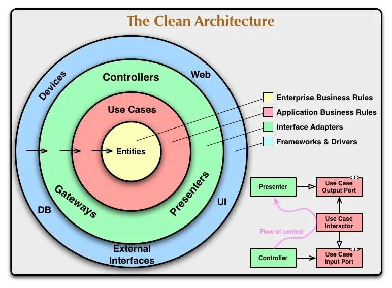

# Prometheus Consortium

A study on Clean Architecture and Flutter

## Concepts used

### - Clean Architecture:
This project is inspired by the concept of Clean Architecture as it was theorized by Uncle Bob (Robert C. Martin's Clean Architecture A Craftsman Guide to Software Structure and Design). The structure and translation into Dart and Flutter's framework is based upon [Reso Coder's](https://github.com/ResoCoder/flutter-tdd-clean-architecture-course) and [Flutterando's](https://github.com/Flutterando/Clean-Dart) guides. The image below is a helpful guide on the code's structure.

